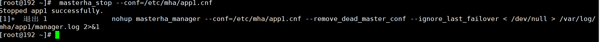

# MySQL高可用主库切换方式总结

> 在Mysql高可用(MHA)主从复制架构中，主库切换方式分为自动切换和手动切换
>
> 当主库出现不可用，主库默认会切换到配置了主库权限的从库，称为自动切换
>
> 当主库可用时，可以采取在线切换的方式，将从库切换为主库，称为手动切换

## 环境介绍

| 环境&软件                 | 版本   |
| ------------------------- | ------ |
| 虚拟机&VMware Workstation | 15 Pro |
| 服务器&CentOS             | 7.8    |
| 数据库&Mysql              | 5.7.28 |

## 架构介绍

| 服务器角色            | 权限                       | 虚拟机名称    | IP              |
| --------------------- | -------------------------- | ------------- | --------------- |
| Mysql高可用监控服务器 | 高可用监控                 | Mysql_MHA     | 192.168.202.110 |
| Mysql主库             | 默认读写,默认主库          | Mysql_Master  | 192.168.202.120 |
| Mysql从库1            | 默认只读,默认从库,可做主库 | Mysql_Slave_1 | 192.168.202.130 |
| Mysql从库2            | 默认只读,默认从库,可做主库 | Mysql_Slave_2 | 192.168.202.140 |

## 配置文件说明

### 高可用监控

> Mysql_MHA主机

`vim /etc/masterha_default.cnf`

>  监控全局配置文件

```shell
[server default]
#用户名
user=root
#密码
password=root
#ssh登录账号
ssh_user=root
#主从复制账号
repl_user=root
#主从复制密码
repl_password=root
#ping次数
ping_interval=1
#二次检查的主机
secondary_check_script=masterha_secondary_check -s 192.168.117.120 -s 192.168.117.130 -s 192.168.117.140
```

`vim /etc/mha/app1.cnf`

>  监控实例配置文件

```shell
[server default]
#MHA监控实例根目录
manager_workdir=/var/log/mha/app1
#MHA监控实例日志文件
manager_log=/var/log/mha/app1/manager.log

#[serverx] 			服务器编号
#hostname 			主机名
#candidate_master 	可以做主库
#master_binlog_dir 	binlog日志文件目录

#Mysql_Msater
[server1]
hostname=192.168.117.120
candidate_master=1
master_binlog_dir="/var/lib/mysql"

#Mysql_Slave_1
[server2]
hostname=192.168.117.130
candidate_master=1
master_binlog_dir="/var/lib/mysql"

#Mysql_Slave_2
[server3]
hostname=192.168.117.140
candidate_master=1
master_binlog_dir="/var/lib/mysql"
```

### 主库

> Mysql_Master主机

`vim /etc/my.inf`

> mysql配置文件

```shell
log_bin=mysql-bin
server-id=1
sync-binlog=1
binlog-ignore-db=information_schema
binlog-ignore-db=mysql
binlog-ignore-db=performation_schema
binlog-ignore-db=sys
relay_log=mysql-relay-bin
log_slave_updates=1
relay_log_purge=0
gtid_mode=on
enforce_gtid_consistency=1
plugin_load="rpl_semi_sync_master=semisync_master.so;rpl_semi_sync_slave=semisync_slave.so"
loose_rpl_semi_sync_master_enabled=1
loose_rpl_semi_sync_slave_enabled=1
loose_rpl_semi_sync_master_timeout=1000
```

### 从库1

> Mysql_Slave_1主机

`vim /etc/my.inf`

> mysql配置文件

```shell
log_bin=mysql-bin
server-id=2
sync-binlog=1
binlog-ignore-db=information_schema
binlog-ignore-db=mysql
binlog-ignore-db=performation_schema
binlog-ignore-db=sys
relay_log=mysql-relay-bin
log_slave_updates=1
relay_log_purge=0
read_only=1
gtid_mode=on
enforce_gtid_consistency=1
plugin_load="rpl_semi_sync_master=semisync_master.so;rpl_semi_sync_slave=semisync_slave.so"
loose_rpl_semi_sync_master_enabled=1
loose_rpl_semi_sync_slave_enabled=1
loose_rpl_semi_sync_master_timeout=1000
```

### 从库2

> Mysql_Slave_2主机

`vim /etc/my.inf`

> mysql配置文件

```shell
log_bin=mysql-bin
server-id=3
sync-binlog=1
binlog-ignore-db=information_schema
binlog-ignore-db=mysql
binlog-ignore-db=performation_schema
binlog-ignore-db=sys
relay_log=mysql-relay-bin
log_slave_updates=1
relay_log_purge=0
read_only=1
gtid_mode=on
enforce_gtid_consistency=1
plugin_load="rpl_semi_sync_master=semisync_master.so;rpl_semi_sync_slave=semisync_slave.so"
loose_rpl_semi_sync_master_enabled=1
loose_rpl_semi_sync_slave_enabled=1
loose_rpl_semi_sync_master_timeout=1000
```

## 切换演示

### 自动切换

> 在Mysql_MHA中进行

#### Mysql_Master可用状态

> 默认状态

##### 开启监控并查看监控信息

> 此时可以看到主库为默认主库Mysql_Master


#### Mysql_Master宕机状态

##### 手动停止Mysql_Master并查看监控日志

> 此时主库已从Mysql_Master切换到Mysql_Slave_1


##### 查看监控信息

> 此时监控已经停止


##### 查看监控实例配置文件

> 此时原来的Mysql_Master配置已经消失了


#### Mysql_Master重新加入集群

##### 修改监控实例配置文件

> 加入Mysql_Master主机的配置信息


##### 手动开启Mysql_Master并且配置复制地址并启动主从复制


##### 开启监控并查看监控状态


### 手动切换

> 演示状态接上文，此时主库为Mysql_Slave_1,从库Mysql_Master和Mysql_Slave_2
>
> 此切换方式需要参与切换的主机处于运行状态

#### 关闭MHA监控

> 必要步骤



#### 手动切换主库为Mysql_Master

```
masterha_master_switch --master_state=alive --global_conf=/etc/masterha_default.cnf --conf=/etc/mha/app1.cnf --new_master_host=192.168.202.120 --orig_master_is_new_slave --running_updates_limit=10000 --interactive=0
```


#### 开启监控并查看监控状态

> 此时主库重新变为了Mysql_Master

